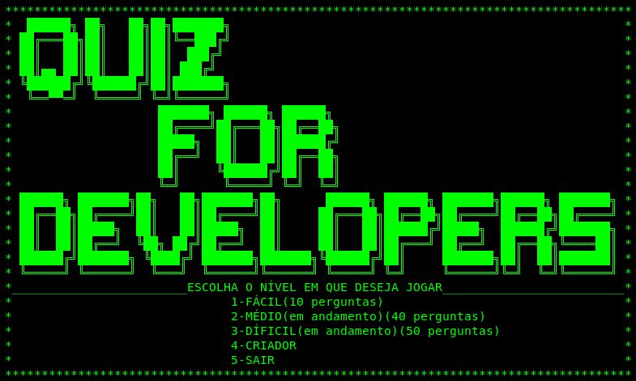

<!-- Quiz_for_Developers
Versão: 13.09.19
Desenvovido por Gustavo Bacagine <gustavobacagine@gmail.com>-->

# Quiz For Developers
<b>Desenvolvido por:</b> Gustavo Bacagine <gustavobacagine@gmail.com>

Quiz For Developers é um jogo de código aberto programado em C feito para rodar no terminal.

Este jogo foi feito como uma forma de aprendizagem da línguagem C, portanto pode ser que ajam alguns erros no código fonte do jogo que serão corrigidos futuramente.

O jogo contém 3 níveis (fácil, médio e díficil).

O nível facil contem 10 perguntas, o médio contém 40 perguntas e o díficil contém 50 perguntas.

O nível fácil esta completo, os níveis médio e díficil estão em andamento. Você pode contribuir enviando perguntas que gostaria de ver no jogo e com sugestões do que devo melhorar no código fonte.

Caso haja atualizações irei modificar este arquivo
